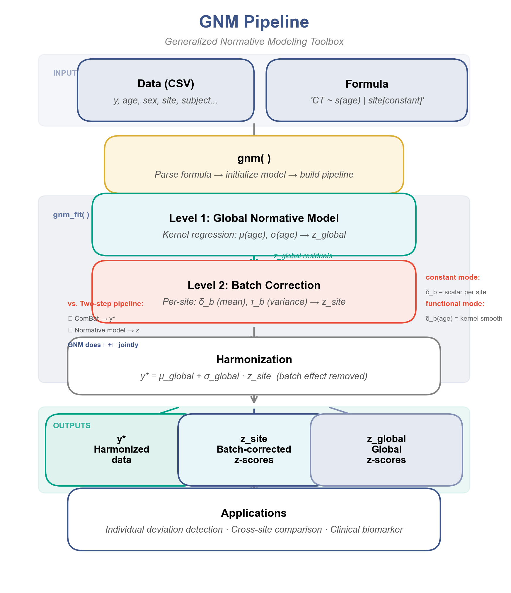
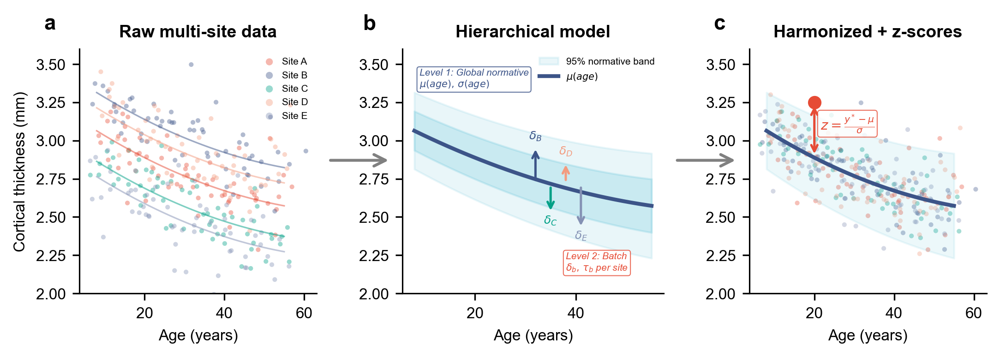
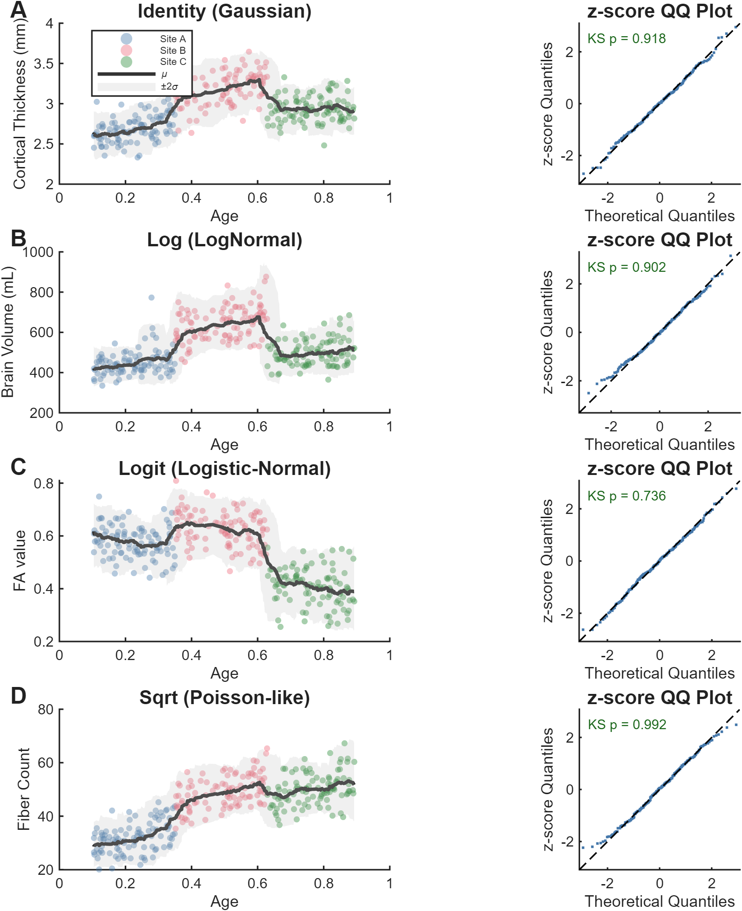
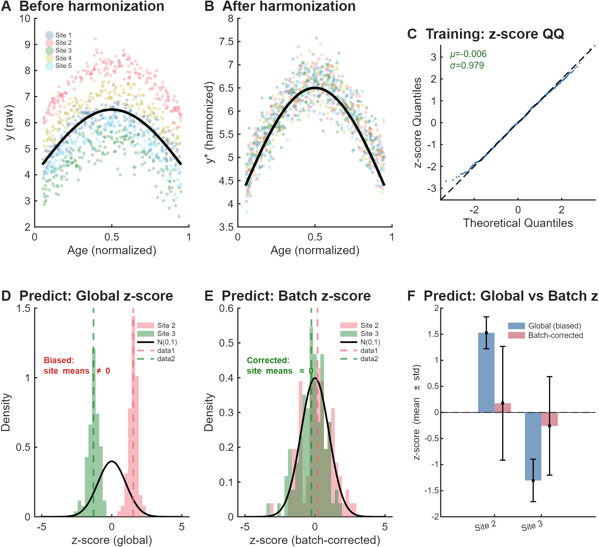
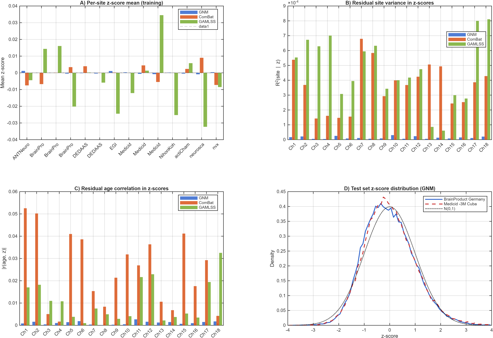
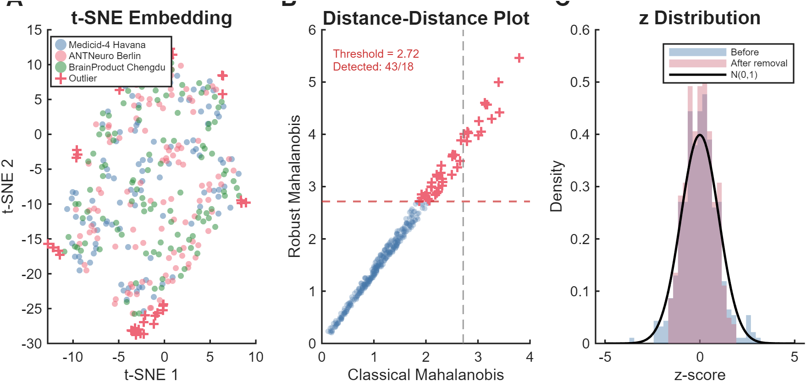

# GNM-ToolBox

**Generalized Normative Modeling: A One-Step Hierarchical Kernel Framework for Multi-Site Brain Charts with Self-Correcting Z-Scores**

[](https://www.gnu.org/licenses/gpl-3.0)
[](https://www.mathworks.com/products/matlab.html)
[](https://github.com/LMNonlinear/Generalized-Normative-Modeling/releases)

GNM-ToolBox is an open-source MATLAB toolbox for **harmonized normative modeling** of multi-site neuroimaging data. It jointly estimates the global normative trajectory and site-specific batch effects via NUFFT-accelerated kernel regression, producing batch-corrected z-scores with a **self-correcting** property: residual site variance cancels algebraically between numerator and denominator.

---

## Overview

<p align="center">
  
</p>

<p align="center"><em>Figure 1. GNM-ToolBox pipeline: from CSV + formula to harmonized data and batch-corrected z-scores.</em></p>

### Why GNM?

Normative modeling characterizes individual brain phenotypes as deviations from a population norm. In multi-site studies, batch effects from heterogeneous scanners and protocols contaminate these z-scores, undermining their use as individual-level biomarkers.

Existing approaches have limitations:

| Method | Limitation |
|--------|-----------|
| **ComBat + Normative (two-step)** | Residual site effects leak into z-scores |
| **GAMLSS** | Parametric, no covariate interactions |
| **HBR** | MCMC scales poorly |

**GNM unifies harmonization and normative modeling** in a single nonparametric framework that:
- Produces **self-correcting z-scores** (site effects cancel algebraically)
- Scales to large datasets via NUFFT acceleration
- Requires no manual bandwidth tuning (automatic GCV selection)
- Works across modalities (MRI, EEG, etc.) by changing one formula string

---

## Key Features

- **One-step harmonization + normative modeling** via hierarchical kernel regression
- **Self-correcting z-scores**: site effects cancel algebraically in the z-score ratio
- **Nonparametric** estimation of both mean μ(x) and variance σ(x) as multivariate functions
- **NUFFT-accelerated** kernel regression: O(N log N) vs. O(N²) for standard methods
- **Automatic bandwidth selection** via generalized cross-validation (GCV)
- **Declarative formula interface**: `y ~ s(freq, age) | site[functional(age)]`
- **Flexible batch models**: constant (ComBat-like) or covariate-dependent (GAMLSS-like)
- **Link functions** for non-Gaussian responses (log, logit, sqrt, probit)
- **Robust outlier detection** via MCD + t-SNE
- **Out-of-sample prediction** without retraining

---

## Method

<p align="center">
  
</p>

<p align="center"><em>Figure 2. Hierarchical solving: (a) decomposition into global trajectory + batch deviation on standardized scale; (b) Level 1 global kernel regression; (c) Level 2 per-batch kernel regression on z-score residuals.</em></p>

### The Unified Equation

GNM instantiates the unified harmonized normative equation:

$$y_{ij} = \mu_g(x_i) + \sigma_g(x_i) \left[\tilde{\mu}_j(x_i) + \tilde{\sigma}_j(x_i) \cdot \varepsilon_{ij}\right]$$

Both the global functions $\mu_g, \sigma_g$ and the batch functions $\tilde{\mu}_j, \tilde{\sigma}_j$ are estimated **nonparametrically** via NUFFT-accelerated kernel regression.

The batch-corrected z-score is computed as:

$$z_{ij}^{(2)} = \frac{z_{ij}^{(1)} - \hat{\tilde{\mu}}_j(x_i)}{\hat{\tilde{\sigma}}_j(x_i)}$$

Because numerator and denominator both incorporate the same batch estimates, residual site-related variance cancels algebraically — the **self-correction** property.

### Relationship to Existing Methods

| Method | μ fixed | μ batch | σ fixed | σ batch | Z-score | Estimation |
|--------|:---:|:---:|:---:|:---:|:---:|:---:|
| ComBat+Norm | linear | constant | — | constant | **two-step** | EB + separate model |
| GAMLSS | additive P-spline | linear | additive P-spline | linear | one-step | Penalized likelihood |
| HBR | parametric basis | site weights | — | constant/site | one-step | MCMC |
| **GNM** | **nonparametric** | **constant/functional** | **nonparametric** | **constant/functional** | **one-step** | **GCV + NUFFT** |

---

## Quick Start

```matlab
% 1. Add paths
run('setup.m');

% 2. Train a normative model
mnhs = gnm('data.csv', 'CT ~ s(age) | site[constant]');
mnhs = gnm_fit(mnhs);

% 3. Predict on new data
T_new = gnm_predict(mnhs, 'new_data.csv');

% 4. Access results
z_scores = T_new.zsitect;       % batch-corrected z-scores
y_star   = T_new.ystarct;        % harmonized data
```

Run the 5-second demo:

```matlab
run('demo/demo_quickstart.m')
```

---

## Installation

### Requirements

- **MATLAB R2022a or later** (tested on R2022a, R2023b, R2024a)
- Statistics and Machine Learning Toolbox
- Signal Processing Toolbox (optional, for some link functions)

### Setup

```bash
git clone --recursive https://github.com/LMNonlinear/Generalized-Normative-Modeling.git
cd GNM-ToolBox
```

In MATLAB:
```matlab
cd('GNM-ToolBox')
run('setup.m')   % adds function/ and external/fast_nufft_reg/ to path
```

The `--recursive` flag pulls the ComBatHarmonization submodule used for baseline comparisons.

---

## Repository Structure

```
GNM-ToolBox/
├── function/                    Core MATLAB functions
│   ├── gnm.m                    Create GNM configuration from formula
│   ├── gnm_fit.m                Fit the model
│   ├── gnm_predict.m            Predict on new data
│   ├── gnm_parse_formula.m      Formula parser
│   ├── gnm_harmonize_batch.m    Batch harmonization
│   ├── gnm_detect_outliers.m    MCD + t-SNE outlier detection
│   └── ...                      (~45 helper functions)
├── external/
│   ├── fast_nufft_reg/          NUFFT kernel regression engine
│   └── ComBatHarmonization/     ComBat (git submodule, for baselines)
├── demo/                        Demo scripts and test data
│   ├── demo_quickstart.m        5-second runnable example
│   ├── demo_general.m           General GNM demo
│   ├── demo_harmnqeeg_log.m     HarMNqEEG demo
│   ├── test_synthetic_data.csv  Small synthetic dataset
│   └── ...
├── fig/paper/                   Paper figure images (PNG)
├── setup.m                      Path initialization
├── LICENSE                      GPL-3.0 License
└── README.md                    This file
```

---

## Formula Syntax

GNM uses a declarative formula interface inspired by R's `gam`/`gamlss`:

```
response_var ~ s(covariate1, covariate2, ...) | batch_var[batch_type]
```

### Examples

```matlab
% Univariate age trajectory, constant batch shift (like ComBat)
'CT ~ s(age) | site[constant]'

% 2-D frequency × age surface, batch shift varies with age (generalizes GAMLSS)
'log_power ~ s(freq, age) | site[functional(age)]'

% Multiple responses, log link for positive data
'log1_1 + log2_2 + log3_3 ~ s(freq, age) | site[functional(age)]'
```

### Link Functions

<p align="center">
  
</p>

<p align="center"><em>Figure 3. Link functions for non-Gaussian responses. Each panel: scatter with fitted curve and z-score QQ plot.</em></p>

Supported link functions: `identity`, `log`, `logit`, `sqrt`, `probit`.

---

## Core API

| Function | Purpose |
|----------|---------|
| `gnm(csv_path, formula)` | Parse formula and initialize model |
| `gnm_fit(mnhs)` | Fit the two-level hierarchical model |
| `gnm_predict(mnhs, csv_path)` | Predict z-scores on new data |
| `gnm_link(name)` | Create link function struct |
| `gnm_detect_outliers(mnhs)` | MCD-based outlier detection |

---

## Validation

### Simulation

<p align="center">
  
</p>

<p align="center"><em>Figure 4. Simulation: 3 batches with nonlinear μ(x), heteroscedastic σ(x), and batch-specific shifts. GNM successfully harmonizes data (B) and produces centered, unit-variance z-scores per batch (D).</em></p>

### Real Data: Three-Method Comparison

GNM was validated on two multi-site datasets and compared against ComBat+Normative and GAMLSS:

| Dataset | Sites | Subjects | Features | R²(site\|z) |
|---------|:---:|:---:|:---:|:---:|
| ABIDE I (MRI cortical thickness) | 11 | 387 HC | 68 ROIs | **0.0003** |
| HarMNqEEG (log-power spectra) | 14 | 1,564 | 18 ch × 235 freq | **0.000014** |

<p align="center">
  
</p>

<p align="center"><em>Figure 7. Three-method comparison on HarMNqEEG. (A) Per-site mean(z) with H₀: mean=0 tests. (B) Per-site std(z) with H₀: std=1 tests. (C) Per-channel |r(age,z)| with Bonferroni significance. (D) Test-set z-score density vs. N(0,1).</em></p>

### Key Results

| Metric | GNM | ComBat | GAMLSS |
|--------|:---:|:---:|:---:|
| **mean(z) = 0** (test set) | **p=0.36 n.s.** ✓ | p=0.58 n.s. ✓ | p=0.018 * |
| **std(z) = 1** (test set) | **1.5% dev.** ✓ | 4.1% dev. | 3.3% dev. |
| **Channels with r(age,z)≠0** | **0/18** ✓ | 12/18 | 6/18 |
| **R²(site\|z)** | **0.000014** | 0.000365 | 0.000470 |

GNM is the only method with:
- Unbiased predicted z-scores (mean ≈ 0)
- Near-perfect calibration (std ≈ 1)
- Zero residual age correlation

---

## Outlier Detection

<p align="center">
  
</p>

<p align="center"><em>Figure 5. Robust outlier detection via MCD + t-SNE. (A) t-SNE embedding with outliers marked. (B) DD-plot. (C) Z-scores before/after outlier removal.</em></p>

Enable with `'clean_individual_outlier', 'true'` option.

---

## Examples

### Example 1: ABIDE I cortical thickness

```matlab
% Config: 1-D age smoother, constant batch
mnhs = gnm('data/ABIDE_I/ABIDE_I_HC_cortical_thickness_68ROI.csv', ...
    'CT ~ s(age) | site[constant]', ...
    'hRangeMu', [0.5 1.0], 'num_hMu', 3);
mnhs = gnm_fit(mnhs);
```

### Example 2: HarMNqEEG log-power spectra

```matlab
% Config: 2-D freq × age surface, age-dependent batch
formula = 'log1_1+log2_2+...+log18_18 ~ s(freq,age) | site[functional(age)]';
mnhs = gnm('data.csv', formula, ...
    'hRangeMu', [0.4 0.4; 0.4 0.4], 'num_hMu', [1 1], ...
    'hRangeSigma', [0.6 0.6; 0.6 0.6], 'num_hSigma', [1 1]);
mnhs = gnm_fit(mnhs);

% Predict on held-out subjects
T_new = gnm_predict(mnhs, 'test_data.csv');
```

See `demo/` directory for complete runnable examples.

---

## Pipeline

```
Input: CSV + formula
  ↓ parse
  ↓ (optional) link transform
Level 1: Global kernel regression
  ↓ fit μ_g(x), σ_g(x)
  ↓ compute global z-scores z⁽¹⁾
Level 2: Per-batch kernel regression
  ↓ fit μ̃_j(x), σ̃_j(x) on z⁽¹⁾
  ↓ compute batch-corrected z-scores z⁽²⁾
Output: z-scores, harmonized y*, normative trajectory
```

---

## Citation

If you use GNM-ToolBox in your research, please cite:

```bibtex
@article{li2026gnm,
  title   = {Generalized Normative Modeling: A One-Step Hierarchical Kernel Framework
             for Multi-Site Brain Charts with Self-Correcting Z-Scores},
  author  = {Li, Min and Wang, Ying and colleagues},
  journal = {NeuroImage},
  year    = {2026},
  note    = {Under review}
}
```

---

## Authors

- **Min Li** — Hangzhou Dianzi University, Hangzhou, China
  [minli.231314@gmail.com](mailto:minli.231314@gmail.com)
- **Ying Wang** — China-Cuba Belt and Road Joint Laboratory on Neurotechnology and Brain-Apparatus Communication, University of Electronic Science and Technology of China, Chengdu 610054, China
  [yingwangrigel@gmail.com](mailto:yingwangrigel@gmail.com)

---

## Contributing

Contributions are welcome. Please:

1. Fork the repository
2. Create a feature branch (`git checkout -b feature/new-feature`)
3. Commit your changes with clear messages
4. Open a pull request

See [CONTRIBUTING.md](CONTRIBUTING.md) for details.
For bug reports or feature requests, please open a GitHub issue.

---

## License

GNM-ToolBox is released under the GNU General Public License v3.0. See [LICENSE](LICENSE) for details.

The ComBatHarmonization submodule is distributed under its own license (Artistic License 2.0).

---

## Acknowledgments

- The fast NUFFT regression engine builds on foundational work by Fan & Gijbels (1996) and Chen (2009).
- ComBat comparisons use the official [ComBatHarmonization](https://github.com/Jfortin1/ComBatHarmonization) implementation (Fortin et al., 2017).
- GAMLSS comparisons use the R package [gamlss](https://www.gamlss.com/) (Rigby & Stasinopoulos, 2005).
- ABIDE I data courtesy of the [Autism Brain Imaging Data Exchange](http://fcon_1000.projects.nitrc.org/indi/abide/).
- HarMNqEEG data from Hernandez-Gonzalez et al. (2024).

---

## Contact

- Issues: [GitHub Issues](https://github.com/LMNonlinear/Generalized-Normative-Modeling/issues)
- Min Li: [minli.231314@gmail.com](mailto:minli.231314@gmail.com)
- Ying Wang: [yingwangrigel@gmail.com](mailto:yingwangrigel@gmail.com)
